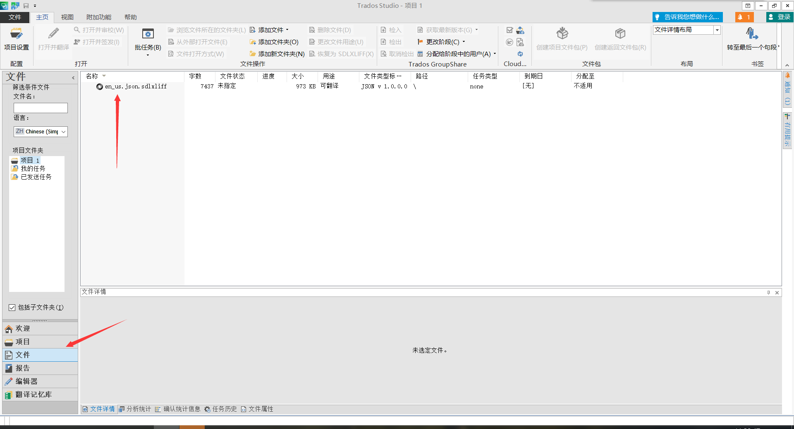
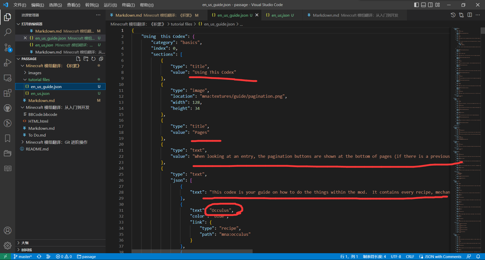
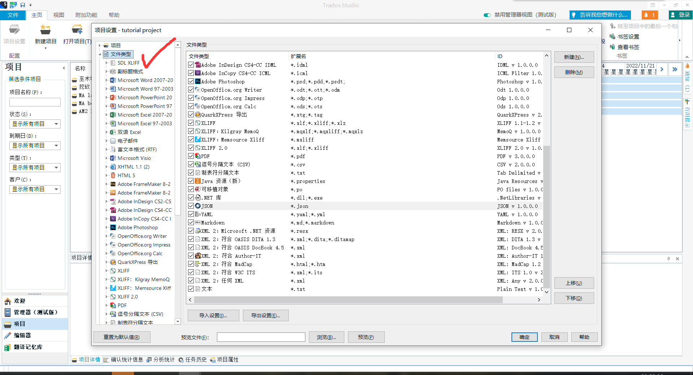
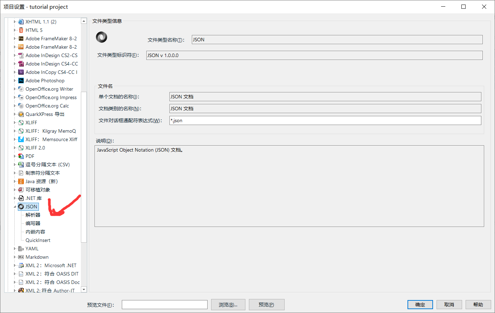
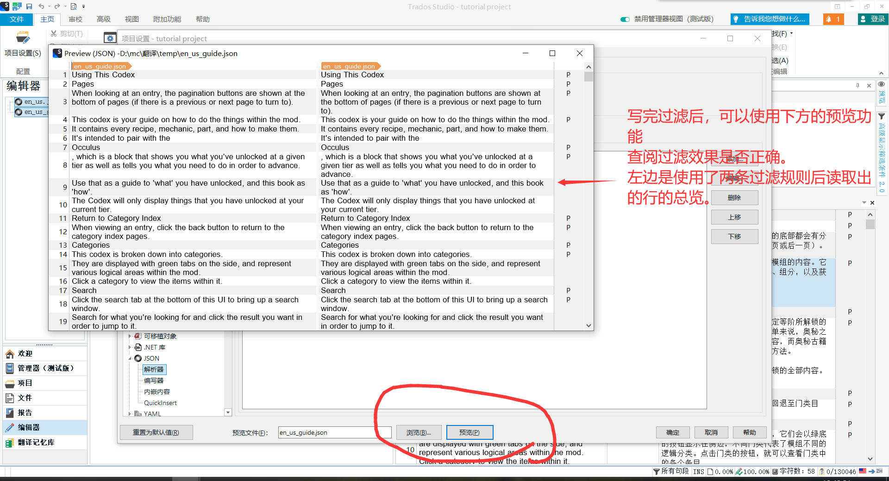
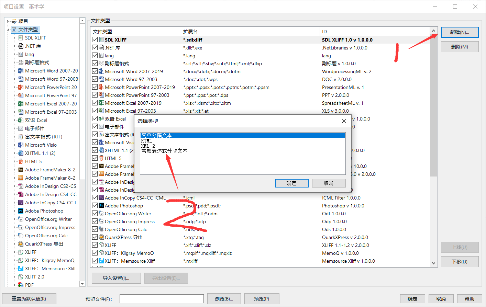
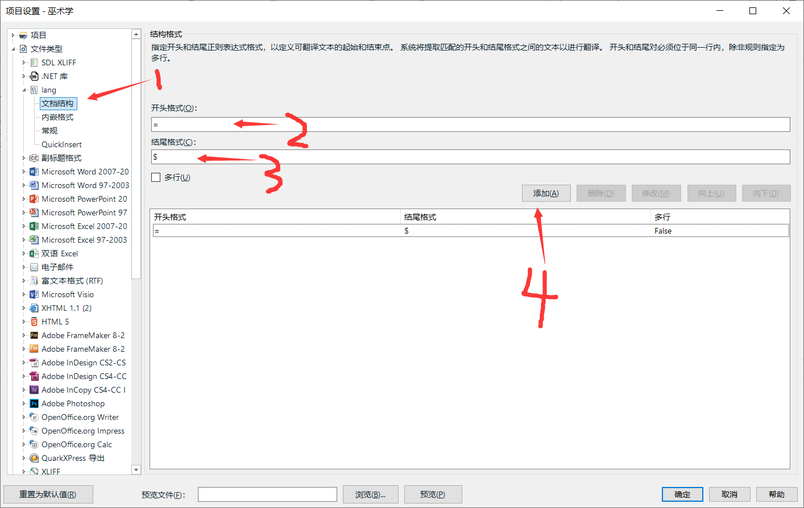

# Minecraft 模组翻译：《积累》（内容需要重新分配以系统化）

## 前言

本文是基础教程《Minecraft 模组翻译：从入门到开发》的进阶教程之一。

本篇教程不再关注翻译投递的问题，这些问题在基础教程中已经得到了需要知道的大部分解答，想要进一步掌握 Git 相关内容则可以参阅《Minecraft 模组翻译：Git 进阶操作》。本文侧重于具体的翻译相关内容。但注意，此“翻译相关”教程并不打算教你如何翻译一个词或者一句话（虽然还是被迫教了），这些技能应该是你在英语课堂中而不是我们这训练出来的，我们也不会提供相应的配套练习。该“翻译相关”，指的是在翻译 Minecraft 模组及其他 Minecraft 相关文本时才可能出现的额外问题。这部分的问题及其答案，只有对此方面已有较多接触的翻译工才会知晓。尽管对于这些问题本篇教程会给出一定回答，但本篇教程并无可能穷尽所有这方面会出现的问题，也不能保证文中答案一定符合语境或惯例或通用处理方式。有什么问题、作什么处理、选什么答案，都是进入到具体的翻译过程中才能解答的问题，脱离了翻译过程的翻译理论，总是难以真正解决实际问题的。所以也请参阅本篇教程的各位，对本文可能包括的问题作补充，共同进步。感激不尽。

虽然本文并不以通用翻译指导为重点，但考虑到一般的翻译人员可能并不会刻意查找细节性的指导，本文也会包含一些问题出现频率较高、应用较广的说明。

我（轩辕）推荐你在十分确定时以 [“忽略所有规则”](https://zh.wikipedia.org/w/index.php?title=Wikipedia:IAR) 作为自己处理问题的态度。

来自 [裂文唬客](https://github.com/LWHK)，本文作者：[清秋](https://github.com/TUsama)，[轩辕](https://github.com/WuzgXY-GitHub)

## 词语翻译

词语翻译从来都是翻译中的重头戏，在模组翻译中，有些词是原版已有的，有些词是遵循常用意而使用的，有些词则是作者自造的。但无论如何，你都得记住这一点：词语翻译从来都是要求“信”字打头，“达”与“雅”总是靠后的。有时候你可能想出一个很通顺或者雅致的词语，但是在词义表达上却总是缺一层意思。那么不要犹豫，选择那个较为能够体现出原文的词语，作为最终的翻译。

但是有的时候，作者的原文甚至写得不如你好——我是说，可能作者在为物品或者方块取名时，一下子没想起好的词，确切的词，又或者原名取得和游戏内的对象差了十万八千里，你完全无法理解这个词是怎么来的。在这种情况下，你可以先去咨询作者，看看作者有没有较为满意的解释，如果有，那么你就照着它的来，如果没有那你还可以建议他改名。

我在这里不会展开讲太多这方面的细节，因为这些细节会在魔法类模组以及科技类模组中不尽相同，这些需要你去摸索，甚至是没有完全确定的，可以循规蹈矩的操作细节的，这些更多的取决于译者自己的翻译习惯，所以细节上千姿百态也就不足为奇了。但是无论如何，请记住一点：我们是要为玩家，为作者负责，在做一些比较重要的决定的时候，请先想一想这一点，再去做决断。

### 所谓“定番”与“非定番”词语

”定番“，严格来说，在这里用这个词是不合适的，因为这个词的本意与翻译并无交集。我将这个词的词义引申为”那些翻译已经完全固定了的词“。这些词，毫无疑问，指的就是原版的词汇。所有的原版词汇，都可以在 [Minecraft Wiki:译名标准化](https://minecraft-zh.gamepedia.com/Minecraft_Wiki:%E8%AF%91%E5%90%8D%E6%A0%87%E5%87%86%E5%8C%96)这一页面上查看到。任何尝试进行模组翻译的翻译工，都得首先知晓原版中使用了哪些英文词汇/词组，并且这些词汇/词组对应了中文中的哪些翻译。例如，经典的 Projectile 一词，应该翻译为”弹射物“，如果你在所有的地方都正确翻译了这一词，那么玩家的相关疑虑便会减轻很多，例如，如果你将某个魔法类模组的魔法的文本介绍中出现的 Projectile 一词，正确翻译为了”弹射物“，那么，玩家就不会发问：这个魔法发出的飞行物所造成的伤害，能不能被”弹射物保护“附魔影响？在正确的翻译情景中，这样的问题是不会从正常人的嘴里问出来的：因为弹射物保护能够降低弹射物的伤害，这是**天经地义**的。当然，不正常的人需要被排除。

还有一个翻译者经常忽略的原版词汇，那便是所有的“颜色”，对应原版颜色的装饰性方块，在翻译时就不要搞出“姹紫”“嫣红”“嫩橙”这种乱七八糟的翻译了。汉语中对于颜色的描绘是相当多的，如果你不想在玩模组的时候，一个颜色有数十个翻译，那我建议你乖乖将 red 翻译为“红色”，pink 就翻译为“粉红色”。

而那些“非定番”的词汇，便是指所有非原版词汇的词语。这些词语我们会在接下来的章节中，以更为细分的形式进行讨论，此处按下不表。

#### 自造词语

自造词汇，作为非定番词汇中的占比较小的词汇，却在各种模组中有着一席之地。这就坑害了广大的翻译者。因为毋庸置疑，自造词汇的翻译是无法在词典上找到的，你必须正确的拆分出自造词汇的各个意义单元，将其组合起来，才能领会到作者想要表达的正确意思。（业余处理，需要重新考虑用语）

现举一例第一段中的例子（本方法仅为示例，所提供的方法仅供参考；除非询问作者，你无法确定自己的猜测是否正确）：

困扰诸多星辉玩家的“法斯刻”、“多米刻”、“艾克斯”三个词到底是什么？

这三个词的原文为：

1. Fosic
2. Domic
3. Ichosic

原译者直接将其音译，且这么长时间都无人来探究这些词语背后作者暗藏的真正意思，实在是令人扼腕叹息。

这些词语在词典上直接搜是搜不到。那么，你必须对其进行适当的拆词，方可找到词语中隐藏的意义。有一定英语水平的人都知道，-ic 作为形容词常见的后缀，说明了这三个词应该是形容词。确定了词尾后，我们将词尾先移开，看看剩下的部分是否有意义：

1. Fos
2. Dom
3. Icho

还是没有实际的意义，但是考虑到英语单词在加上词尾时，往往会先削去一两个结尾的字母，再添加相应的词尾。我们可以考虑再在此基础上做字母变动。在这种情况下，我们可以将这些剩余部分写入词典中，检查词典弹出的备选项，看看有无单词是比较贴合游戏中的实际作用的。

我们能够查到：

1. Foci
2. Dome
3. Ichor

这三个词，较之原来的形式，都发生了部分的字母变动，或增或减，但是这些增减是有着游戏内内容的依据的。以下是论证（引号乱七八糟）：

1. 对于词“Foci”，选择它是因为它有“集中”之意，结合游戏中的“法斯刻之域”（此处也是音译）的设定，我们立刻可以意识到两者之间的意义关联：“法斯刻之域”乃是星能汇聚之地，恰有 Foci 的“集中”之意在里头。这可不是巧合，很有可能是作者就是沿着这个词创造出了“Fosic”这一词。此时，我们已经可以将这个“Fosic”做“Foci”来看待，结合星辉的设定，在 1.16 的星辉魔法中 ，我将其定为“汇星”。
2. 对于词“Dome”，与物品的效果完美贴合，使用了“多米刻共振器”后，可以显示出“效应放大器”（在最新版中也改了名字，为“仪式基座”，此处乃是最最基本的误译）的效果范围，动画上乃是一片区域。所以此处翻译定为“穹域”。
3. 对于词“Ichor”，与“纳耳狂曼喷口”（翻译亦有变动）的效果完美重合，此处定为“液华”。

以上 2、3 两个解释，均出自于 [Ex](https://github.com/Determancer)，我们 [LWHK](https://lwhk.github.io) 的中坚人物，在此十分感谢他的工作。

#### 老词新意

#### 对哏的翻译

## 长文本翻译

### 翻译原则的优先级

### 翻译的整体风格倾向

翻译腔（部分文化环境下翻译腔也是可取的，如日语 - 轻小说）

## 其他细节

### 一般语文问题

本段中标题全部为错误例子，错误之处以**粗体**标明。

1. 本模组添加了一些物品、方块<b>、以及</b>生物。

    顿号不能与并列性连词同时使用。本例中并列的三个语素从`物品`、`方块`和`生物`变成了`物品`、`方块`和`以及生物`，这显然是错误的。

    正确版本：

    `本模组添加了一些物品、方块、生物。`（语法上没问题，但本例中略显生硬）

    `本模组添加了一些物品、方块以及生物。`

2. 你可以选择生存<b>/或</b>创造模式。

    斜杠自身已经有“或”的含义了，不能与同类连词同时使用。有些原文包含 `/or`，此时应视情况在翻译中应用合理的用法，而不应延续原文的错误。

    正确版本：

    `你可以选择生存/创造模式。`

    `你可以选择生存或创造模式。`

3. 我想知道<b>为什么</b>这模组没汉化<b>？</b>

    `为什么`等特殊疑问词引导的从句不能与问号同时使用。

    正确版本：

    `我想知道为什么这模组没汉化。`

    `为什么这模组没汉化？`

4. 我<b>是</b>男。

    多数人看到标题都能一眼发现问题，少了一个“的”，对吧？那么我们来换一个更长的例子（本例）。

    ``本模组是在区块更新时使用动态渲染，并在已加载区块中使用静态渲染。`

    你可能觉得这个句子没啥问题，所以我们先放正确版本：

    `本模组是在区块更新时使用动态渲染，并在已加载区块中使用静态渲染的。`（本例中略显生硬）

    `本模组在区块更新时使用动态渲染，并在已加载区块中使用静态渲染。`

    看出问题了吗？本段标题中的问题是谓语为`是`时，形容词缺少助词`的`的问题，`男`是一个形容词，而中文中我们通过添加`的`可以将之转换为名词（如`快看那边那个男的`），也可以使之符合这种定语的形式规则。名词与形容词皆可得到合理解释，此处不应过度纠结标题中`男的`二字的词性。本例亦同，正确版本的第一句中`在区块更新时使用动态渲染，并在已加载区块中使用静态渲染的`是宾/定语，可以在谓语`是`后使用，构成完整的句子；第二句可以简化为`本模组使用渲染`，也即一个简单的主谓宾结构语句，其他部分都作修饰用。

5. 本模组的矿脉生成<b>频率多</b>。

    不是大问题，但还应注意词语搭配得当，`频率`只能`高`不能`多`。

    正确版本：

    `本模组的矿脉生成频率高。`

6. <b>为什么</b>你崩溃<b>的原因</b><b>是因为</b>你没装前置。

    同义词多次出现。

    正确版本：

    `你崩溃的原因是你没装前置。`

    `你崩溃是因为你没装前置。`

    `你没装前置。`（玩笑）

7. 这个模组的<b>重置版</b>需要<b>重头</b>开发。

    格雷错被字。`重置`一词自身不喊错别字，但用在哲理并不正确，应注意去分`重置`和`重制`。类似的栗子很多，比如`奔溃`、`客服端`、`虚似机`，等等。如果你连这鞋问题都看不出来，那请在进一步烦译前提高自己打认字数。

    正确版本：

    `这个模组的重制版需要从头开发。`
    
8. `其`是一位父亲的儿子。

    `其`这个字比较特殊，它不能作为主语或宾语单独出现，但可以作定语或作主语或宾语且后接补语。
    
    正确版本：
    
    `他是一位父亲的儿子。`
    
    `其身份是一位父亲的儿子。`（对原句略有修改，仅供语法示意）
    
#### 排版

*WIP*

例仍皆错/不推荐；粗体标出错误

1. 1000m**b**/t -> 1000 mB/t

2. Git**h**ub用户sparanoid -> GitHub 用户 sparanoid（推荐）

3. 全角标点符号（联系国标、《夹用英文的中文文本的（草案）》）；可参考 WP；省略号（……好丨......差丨...愚蠢）

### 游戏用语问题

#### 各类定番术语

如上文所言，原版翻译是模组翻译工必不可少的基本功，多看多练，才能在翻译时记住这些词汇，至少能做到认出这个词翻译的确定性，不会自己安一个新的翻译上去。

以下列举出了一些常见的，易被翻译错误的原版词汇及基础模组术语：

（轩辕你来吧）（我还没来）（字幕）

不同模组类别的译名（可参考各模组的译名表）：

#### 学术词语

CNKI

可以尝试以 [《地质学报》的矿物名中英对照表](https://wuzgxy-github.github.io/) 作为参考，仍需注意统一性

#### 键鼠操作称呼问题

*WIP*

具体描述各种键鼠操作的正确称呼。

（非触屏情况下）点击与单击

左击/键与单击

右键与右击

点两下与双击

按与摁

Shift+单击与按住 Shift 单击

Shift 和 sneak 的区别

左 Ctrl

### 革新的时机与注意事项

### 对哏/迷因的翻译

与某圈主题并不重合的模组化用了大量该圈内容

Suzune Maiki：
应当翻作日语，尽可能保留作者「想向圈内人传达这个梗」的想法

清秋：
除了能两全的，应当保留原文，反正我不翻就和我没关系（WuzgXY：最后这句显然是不负责任的说法，你应该说出于各种考虑保留）

CrmP：
所有的都应当翻作中文，因为翻译首先要合理达意，圈外人相比圈内人又多了太多，圈内人照顾不到就算了

WuzgXY：
因为该圈内容自身与模组化用处直接挂钩，本就很难照顾到圈外人，故不能两全时应保留原文

## 进阶工具
vsc虽好，但总归不是专门用于翻译的软件。对于译者而言，最理想的情况就是拿到文本就开始翻译，不用考虑别的。有些刚涉及模组翻译，还没有承接过大项目的人可能会问：难道我们平常不就是这样吗？直接从模组文件中找出对应的英文文件，然后开始翻译，其中并无多少的曲折啊？然而当你打算长期维护一个项目的时候，vsc的问题就会暴露出来的：
1. 有时，某个版本可能是过渡版本，你并不打算翻译，只是将其先行搁置。然而当你再次想起这个项目时，你已经忘了你最后翻译的译本的对应模组版本，因而你也不知道英文文件中的长文本是否有改动，改动了哪些。如果你是半路接手某个项目，而且没有项目交接，那么这个问题几乎是必定遇到。
2. 当你长期跟进一个项目时，忘记其中的某个术语再正常不过了，尤其是你同时还在跟进其他的情况下，这种现象尤为严重。为了解决这样的问题，你必须回过头搜索一下之前的这个术语，看看自己将它翻译为了什么。
3. 你维护的项目可能是一个整合包，其中涉及了大量的模组以及译名，你根本不可能全部记忆下来，对于那些不熟悉的模组，你只能挨个翻阅语言文件，甚至有时候，你还得去CFPA的仓库寻找，因为某些译者并不愿意或是不能将汉化提交到官方仓库，只能转而放到CFPA处。
4. 某些模组的文本格式比较复杂，或是文本量比较多。你在翻译的时候，手一会得在键盘上打字，一会得用鼠标选定文本，一两次还好，次数多了就会觉得非常麻烦。
5. 某些文本涉及到大量的重复工作，比如原版颜色，比如某些家具模组的大量重复单词等，这些你得手动替换，也是比较麻烦。而且有的时候，你得连续遇见了两三次同一个单词的时候，才会意识到你需要批量替换这一单词，一想到自己重复劳动了那么几下，虽然没什么体力成本，但总觉得心理上不舒服。
6. 在跟进某些更新较快且有指导书的模组时，偶尔会出现指导书语言文件大幅重排或是大量添加的情况。因为指导书的格式各不相同，因而没有一个统一的工具来节省你重排和复制粘贴的功夫。每次这种事情发生，都会消耗掉译者大量的时间。

以上种种，我认为对于任何接触了mcmod翻译的人员来说，都或多或少的遇到过。究其原因，不是因为我们自身的业务能力不过关，而是因为vsc从本质上来说就**不是一个翻译软件**，它用来文本编辑，用来写代码，都是可以的，实际上这些就是它的本职工作。但是它不能够在你忘记某些术语的时候贴心地为你跳出之前翻译过的术语，它也不能够为你省下反复挪手的力气，你依然得一上一下。那么，是否有这样的一种软件，能够解决这些痛点呢？那自然是有的，这类软件叫做CAT（Computer-Aided Translation）软件。

CAT软件有很多，本教程不一一举例，这里仅介绍 CAT 软件中的老大哥——Trados。我会在下文中通过实操的方式来讲解此软件的用法，

### 用于翻译高版本的 json 格式语言文件
首先我们需要准备如下的东西：
1. 主角 Trados，找个破解版的，正版的你买不起
2. 嘉宾某模组，用于提供素材

如何安装 Trados 此处按下不表，能看到这篇文章的至少应该有互联网冲浪的经验，建议自己解决。
接下来把模组文件中的英文语言文件拿出备用。注意，你需要校对一下该文件的格式：用vsc打开，把里面重复的key删除。通过vsc格式校验的json文件，名字是正常白色，如果是黄色或是红色说明依然没有通过。

#### 配置项目并翻译

接下来，打开 Trados，你会看到如下的界面：

这个时候，你就可以进行翻译了，将刚刚准备的文件拖入其中，并选择创建新项目→创建本地项目

然后便会进入到如下的界面中：

设置完成后，点击下一步：

再下一步：

点击创建后，设置你的翻译记忆库（待会会专门分出章节来介绍），这一步非常重要，一定要留心：

第二步跳过，来到第三步：

最后点击完成即可。

接下来是术语库，术语库同样需要你去创建：

成品：

然后一直点击下一步，最后点击完成。
自此，翻译记忆库以及术语的选定就都完成了。这时你会跳转回项目设置，直接点完成就好。当然，我建议有能力的译者可以点击下一步，看看后面的那些选项是干什么的，除了云翻译记忆库外，其他的步骤或多或少都有用，只是此处为新手教程，用不到罢了。

点击完成后关闭，软件会跳转到“项目”视图（左下角为会显示目前你在哪个视图）：

双击进入到项目中，便会来到“文件”视图，再次点击，就会跳转到“编辑器”视图：

试输入：

如果你确定这一翻译无误，那么只需按下Ctrl+Enter，就可以将此句段的状态更改为“已翻译”，并跳转到下一未确定句段：

#### 过滤非全读取情况下的json文件并进行翻译
因为json文件的泛用性，所以trados可以极佳地兼容高版本模组的语言文件，只需稍作处理，就能导入到trados内翻译。但这里就出现了一个问题：对于模组提供的语言文件来说，其内基本所有内容都需要翻译；但并不是所有需要翻译的json文件，其内的每行都需要翻译，比如帕秋莉模组的json文件，或是一些模组自己搓的书籍json，这些文件中几乎大半的行都不需要翻译，只有少部分的text需要翻译。那么我们需要如何使用trados处理这样的文件呢？这里便需要我们使用到新的工具——[JSON路径](https://www.cnblogs.com/reroyalup/p/13283300.html)。

拥有了这个工具，我们就可以在trados内对json文件过滤，滤掉不需要的行，只选择需要的行。现举一例（相关文件放在隔壁文件夹）：

1. 首先我们可以肯定，en_us.json文件内的所有行均可以翻译，关键问题是对en_us_guide.json的处理，可以看到：

只有用红线标记的地方才需要翻译，其余行均为格式行，不能翻译，甚至不能修改，那么首先我们可以对其做最最基本的分析：通篇看下来，所有的翻译对象的key不外乎"text"和“value”，那么，我们只需要简单地过滤一下，将所有对应的key摘出，即可完成。我们首先新建一个项目，加入文件en_us_guide.json，完成相关设置后，跳转到第八步“汇总”，然后点击“全部项目设置”：

然后找到“文件类型”：

然后再找到“JSON”：

再依次点击：

即可写入过滤规则。按照我们之前的分析，只需过滤出其中key为“text”和“value”的键值对即可，那么我们需要写入如下两条过滤：
`$..value`
`$..text`

即可顺利地读取出guide文件内的需要翻译的行，以下是效果：

2. 然而，我们的这一过滤只能处理guide文件，模组的lang语言文件很明显是不能这样处理的，我们必须找到能够同时读取出lang文件以及guide文件的过滤规则集合，毕竟这两个文件同属于一个模组，若是分开成两个项目不是很方便管理。
在写出多规则之前，我们需要了解trados读取JSON路径的顺序。当你在json文件类型的解析器中写入过滤后，trados会尝试从最下面的一条规则开始读取，然后逐一向上依次读取。这意味着，你需要把最普适的规则放在下面，然后再将进一步的过滤放在上方。
有了这一知识，我们不难想到一个最简单的过滤方法：先将所有的行选出，然后再将不需要的行选出，将其设置为不可翻译。
以下是一个例子：

只要你将文件中所有不需要的key依次剔除，即可完成过滤，

然而，这种方法一听就知道工作量比较大，所以我们最好通过取巧的方式来过滤，而不是暴力枚举。我们可以使用如下的过滤规则

`$.version` 不可翻译
`$..value`  可翻译
`$..text`   可翻译
`$.*`       可翻译

下面是解释的环节：首先，最下方的过滤针对的是lang文件，这里的意思是只读取根节点下的第一级key的value。这一规则应用于lang和guide后，只有lang文件会成功返回value，而guide文件返回的仍然是键值对。若是过滤返回了键值对，trados会直接舍弃掉这些键值对，因而整个guide文件唯一能够读取的行就只有最后一行：
`"version": "1.7.1.9"`
中间两行的读取与上文一样，此处不表，最上面一条针对的是guide内的多余的行。
至此，你便能给完美地读取这两个文件了。

### 读取非json文件并翻译

有读者已经意识到了，mcmod的语言文件的格式并不是只有json这一种：低版本模组的lang格式，一些模组会用到的XML格式，任务书的snbt格式；如果是整合包，还得包括crt所使用的zs脚本，kubejs的js文件，甚至还有groovy等文件。总之，这里所谈及的文件格式有些原生trados便能够处理，有些则不能，例如.lang文件，这玩意只有mc在用，trados自然不可能会为其添加支持。
但这并非意味着trados不能处理这些文件，上文中我们提到了“文件类型”选项卡，细心且实操过的读者肯定发现了，traods不仅支持极多的文件类型，还提供了自定义读取文件的方法，这意味着，我们只需要稍加调教，就能够使用trados读取这些文件并翻译。

首先，我们来看使用得最多得.lang文件：

1. 首先还是创建项目，并导入一份.lang文件，与上文的操作基本类似。
2. 然后到第八步，依次点击进入到文件类型，此时再点击如下按钮：
3. 进入后，修改窗口内的内容：
4. 依次点击并输入：

此处需要做出一些解释：在这里，我们将标点符号“=”视为开头，每行的结尾（即“$”，此处是正则语法）作为结尾，过滤出了每行需要翻译的内容。
至此，就非常简单地完成了对lang文件的读取并翻译。
依照此方法，你可以顺利地处理其余的文件，将它们读取到trados内并开始翻译。

### 翻译记忆库（TM），术语库以及Trados的各类工具

