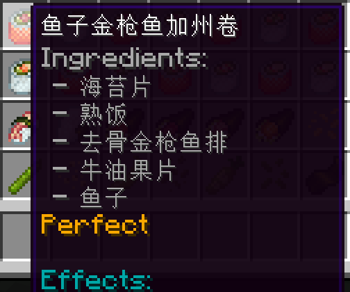
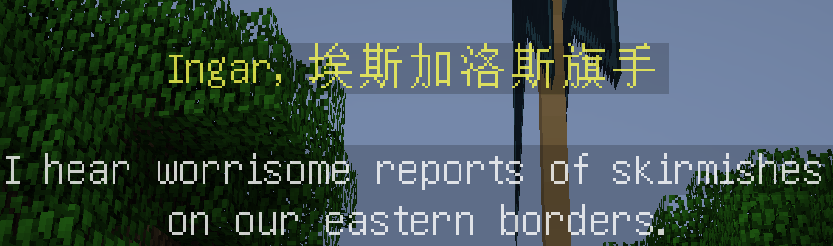

# Never Use Hardcode in I18n

"Hardcoding" means you embed something, especially texts in this passage, into source code or otherwhere, where they are not changable through language file, resource packs, configuration or other files which are able to be easily customized.

I am a native Chinese speaker, and I have hosted or participated in translating a few mods into Chinese, including *NuclearCraft: Overhauled* and its addons, *The Undergarden*, *Farmer's Delight*, *Sushi Go Crafting*, *The Lord of the Rings* and others. In my translation experience, I noticed that many mods ignore, or even reject to internationalization. This greatly reduces gaming experience of non-English speakers who do not understand English well.

A good mod should consider about localizing, and use no hardcode. If you are not a Chauvinist, and you ever want your mod get localized, receive language files and be spread over non-native speakers of English while gaining more downloads, you should care about i18n.

I will show examples of not obeying internationalizing standards enough. Most examples are in 1.12.2, but that does not matter. Some problems have been fixed, but most are not. All copyrights belongs to modders themselves, and I will delete them if with tort. There are endless examples, and these are just some drops in the ocean. The solutions listed here are not the final answer either. There are endless problems on the way making i18n, and no individual can solve them independently. I am just asking for some care for my language here.

## The Only Principle: **Do Not Hardcode ANYTHING**

### Do Not Hardcode Strings

All strings should be translatable. This includes all the item/block names ~~(no one would try to hardcode these becuase of Forge, right?)~~, descriptions and tooltips, book/lore entries, GUI texts and all other strings.

Examples of hardcoding tooltip:

[*Sushi Go Crafting*](https://www.curseforge.com/minecraft/mc-mods/sushigocrafting)



[*Patchouli Guidebook*](https://www.curseforge.com/minecraft/mc-mods/patchouli) (hardcoding of ordinal numbers)


Example of hardcoding book/lore entries:

[*The Lord of the Rings Legacy*](https://www.curseforge.com/minecraft/mc-mods/the-lord-of-the-rings-mod-legacy/) (not exactly hardcoding though, but no i18n)



Example of hardcoding GUI texts:

[*The One Probe*](https://www.curseforge.com/minecraft/mc-mods/the-one-probe)


**Solution:**

a. Use `setTranslationKey()`, `I18n.format()`/`I18n.translateToLocal()`, `TextComponentTranslation()` or any other methods defined by Minecraft or yourself.

b. Use ICU4J when processing ordinal numbers or other regular strings.

### Do Not Hardcode Texts **into** Pictures

It's not unacceptable to embed texts into pictures, but please at least make them localizable, like what *Patchouli Guidebook* does for images in books.

Example of hardcodig text into picture:

[*Arcane Archives*](https://www.curseforge.com/minecraft/mc-mods/arcane-archives)


**Solution:**

a. Put resources into a folder named with language code such as `en_us`, and invent a way to hot-reload pictures when switching to another language in game (recommended), like *Patchouli Guidebook*.

b. Invent a way to render formatted and localizable texts floating over the image.

### Do Not Hardcode Rules **Piecing Together Texts and Pluralizing Words**

Each language has its own rule transforming words. `Iron Sword` in Spanish is "Sword of iron" (`Espada de hierro`; it has different sequence and capitalization of words), and in Chinese is "ironsword" (`铁剑`; there is lack of capitalization and space). It is unacceptable to most people seeing `de hierro Espada` and `铁 剑` as they are ugly or grammatically wrong. So you can not use text rules like `I18n.translateToLocal(key_name_iron) + " " + I18n.translateToLocal(key_name_sword)`.

Example of space which should not exist:

[*LibVulpes*](https://www.curseforge.com/minecraft/mc-mods/libvulpes) (already fixed in 2017)


Example of unchangable pluralization:

[*ToroQuest Revamped*](https://cursefire.com/minecraft/mc-mods/toroquest-revamped)

 (`绿宝石s` refers to "emerald**s**")

Solution **?**:

~~a~~. Add a key into all language files, such as `key.modid.text.rule=%1$s %2$s`, then use `String.format(I18n.translateToLocal("key.modid.text.rule"), I18n.translateToLocal(key_name_iron), I18n.translateToLocal(key_name_sword))`, so that Spanish localizers should be able to change the value to `%2$s %1$s` and so as `%s%s` for Chinese localizers. **BUT:**

In Spanish, `(Material) Horse Armor` is actually `Armadura (material) para caballo`. This creates a problem to localizers: if you add `para caballo` into `key.modid.text.rule`, name of every tool or armor will contain `para caballo`; and if you add `para caballo` into the keys for materials, it will come to the same result.

Solution **?**:

~~a~~. Add many keys which describe rule of piecing together strings for every type of tool, armor and so on, into all language files as described before, then call each of them. In this way, every type of item gets an independent rule piecing together texts, instead of sharing a common one. **BUT:**

`Stone Pickaxe` and `Stone Axe` have the same attributive word in English: `Stone`. But in Czech, there are two different prefixes: `Kamenný` and `Kamenná`, respectively before `krumpáč` (pickaxe) and `sekera` (axe). Also, `Chainmail Helmet` and `Iron Helmet` are both `Helmet` in English, but in German they are `Kettenhaube` and `Eisenhelm`. This solution cannot solve the problem of `Kettenhaube` and `Eisenhelm`. If you set a rule as `key.modid.text.rule.helmet` you will find no rule there matches both words in German.

I do not understand why the same word `Helmet` turns into different words `haube` and `helm`, and `Stone` turns into `Kamenný` and `Kamenná` either. Maybe because of grammar genders, maybe because of arrogant translators, but this problem exists anyway.

**Solution:**

a. From *LibVulpes*: Introduce a function to check if there is a specific kind of key existing. If true, use its value as the string to output, else you simply piece strings together and output:

```java
// Not completely true codes, only for demonstration

String translate = "tile." + MODID + "." + itemType + "." + material + ".name";
if (I18n.canTranslate(translate))
    return I18n.translateToLocal(translate);
return ("" + I18n.translateToLocal("material." + material + ".name") + " " + I18n.translateToLocal("type." + itemType + ".name")).trim();

// en_us.lang
type.gear.name=Gear
type.ore.name=Ore
material.Titanium.name=Titanium
material.Steel.name=Steel
// Output: Titanium Gear, etc.

// zh_cn.lang
tile.libvulpes.gear.Titanium=钛齿轮
tile.libvulpes.gear.Steel=钢齿轮
tile.libvulpes.ore.Titanium=钛矿石
tile.libvulpes.ore.Steel=钢矿石 (not really)
// Output: 钛齿轮, etc.
```

This way of solution solves the problem very well and is highly recommended. In English and some other language files the workspace is still as clean as before, and in all languages the output item name is grammatically and visually correct. But if there is a need of generating strings from configuration files, and you have to piece strings from many places together, you can check this:

b. From [*NuclearCraft: Overhauled*](https://www.curseforge.com/minecraft/mc-mods/nuclearcraft-overhauled): Introduce a key allowing localizer to customize the translating method in language file with `JS_ENGINE.eval()`. It is also easy for English itself to pluralize in this way, and it is highly recommended too.

```java
public static int getPluralRule(int count) throws ScriptException
{
    return (int) JS_ENGINE.eval(Lang.localise("nc.sf.plural_rule", count));
}

// en_us.lang
nc.sf.plural_rule=%d == 1 ? 0 : 1
nc.sf.reactor_casing0=%s reactor casing
nc.sf.reactor_casing1=%s reactor casing
nc.sf.conductor0=%s conductor
nc.sf.conductor1=%s conductors

// zh_cn.lang
nc.sf.plural_rule=0
nc.sf.reactor_casing0=%s反应堆外壳
nc.sf.conductor0=%s反应堆连接器
// There is no plural form of nouns in Chinese
```

This mod has other string formatter features, including logical process of `and`, `or` and `no`. It can deal with some forms of grammar genders also, as its customizable strings include both attributive and objective words.I believe you can learn much by reading [its code](https://github.com/tomdodd4598/NuclearCraft/blob/1.12.2o/src/main/java/nc/util/I18nHelper.java).

Are these all above **enough**?

Well, `سيف حديدي` is `Iron Sword` in South Africa Arabic, and it is written from right to left (RTL). With mixing this into a text, you do not know what is going to happen. I do not know either, though I know ICU4J has function to deal with this. Considering that there is currently not many localizations from RTL languages, and even Minecraft didn't make this well, this problem is complex and not that important. What is notable, is that there will always be exceptions in i18n and l10n, so the only way with completely no problem is allow localizers to change the whole string instead piecing some strings together.

### Do Not Hardcode Text Process Mechanics

Most books in Minecraft split a long string into lines by a half-width space: `-> <-`. But in Chinese and Japanese, there is no such space completely. So when processing some specific characters, you should consider about whether there is and whether it is used as you want in other languages. You may not choose the quotation mark `'` as a grammar symbol, because it is widely used in French such as `d'avoir`, and it would not be a good choice to make your renderer depend on punctuation marks because they work in different ways in different languages and some language may not have them: double quote `"` does not exist in Russian, and all half-width marks (such as `.`) are full-width (such as `。`) in Chinese and Japanese (for difference between half-width and full-width, you can check [Wikipedia](https://en.wikipedia.org/wiki/Halfwidth_and_fullwidth_forms)). Ironically, Minecraft itself supports full-width marks badly until these years, but that does not mean it is useless to consider about them: though supported not that good, they are still supported and exist in all texts in both languages, and there are also third-party full-width fix resource packs.

Examples not splitting Chinese texts correctly (the first line has no space, and the second one has space every 12 characters, which were added manually with RegEx; those spaces make localization workspaces messy):

[*Botania*](https://www.curseforge.com/minecraft/mc-mods/botania) (solved in later Minecraft versions with *Patchouli Guidebook*, but never in 1.12.2)


[*Immersive Engineering*](https://www.curseforge.com/minecraft/mc-mods/immersive-engineering) (it splitted lines well, but with an overflowed amount of charcaters, it created a new line every time meeting a space)


Example and solution of showing locked researches in [*Thaumcraft*](https://www.curseforge.com/minecraft/mc-mods/thaumcraft):

[*Thaumcraft Localization Optimizer*](https://www.curseforge.com/minecraft/mc-mods/thaumcraft-localization-optimizer)

**Solution:**

a. Optimize your own renderer or use renderer by Minecraft.

b. Ask players to install [*WrapFix*](https://www.curseforge.com/minecraft/mc-mods/wrapfix) or such third-party mods.

# Some Other Suggestions and Problems on I18n

## Customizable via Resource Packs

Examples not changable via resource packs:

[*ChromatiCraft*](https://www.curseforge.com/minecraft/mc-mods/chromaticraft) (working as intended)

[*The Lord of the Rings Legacy*](https://www.curseforge.com/minecraft/mc-mods/the-lord-of-the-rings-mod-legacy/)

## Ensure No Exceptions Happening

### Definition Ratio and GUI Scale Problem of Unicode Font

I guess this might happen when Unicode font is enabled, but I have not studied on this well.

Example of unclear characters:

[*NuclearCraft Reactor Builder*](https://www.curseforge.com/minecraft/mc-mods/nuclearcraft-reactor-builder) (at the middle of the right there is the normal resolution on my device)


Example of not considering Unicode font:

[*The Lord of the Rings Legacy*](https://www.curseforge.com/minecraft/mc-mods/the-lord-of-the-rings-mod-legacy/)


### Use UTF-8 without BOM Encoding

You can use `#PARSE_ESCAPES` in `.lang` files to get to [Java Properties](https://docs.oracle.com/javase/8/docs/api/java/util/Properties.html#load-java.io.Reader) features. If you do not use UTF-8 and call the default encoding of the client system, it might crash.

Example of not using UTF-8 and solution:

[*Electroblob's Wizardry*](https://github.com/Electroblob77/Wizardry/pull/479)


## Add the ModID into Translation Keys

If you do not, your keys are likely to conflict with other mods, and override those or get overrided by those. Some even conflict with vanilla Minecraft. If you are sure that your key will never conflict (such as `item.no.one.would.use.this.key.i.am.pretty.sure.asdgdsafgasfd.name`), then you can leave it behind.

Example of mod of key conflict and solution:

[*Mekanism*](https://github.com/mekanism/Mekanism/issues/4698)

## Why Do You Enum Thousands of Roman Numerals in Language File?

Example of enumming:

[*So Many Enchantments*](https://www.curseforge.com/minecraft/mc-mods/so-many-enchantments)

