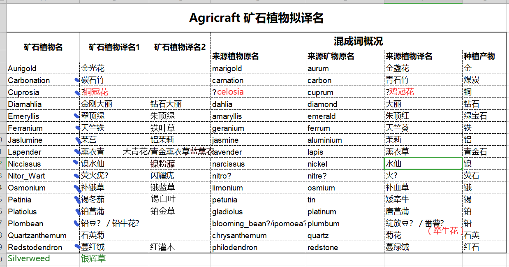

# Minecraft 模组翻译日常积累

## 词根词缀

### 希腊语/拉丁语

#### 复数

-us -> -i

-um -> -a

-a -> -ae

-e -> -ia

## 术语翻译

### Raw

原矿、粗矿、未加工矿石、生矿、裸数据

## 考据记录

### 农业工艺

有地方需要增补

### 深暗之园

*未开工*

## 抽象词

**汉语喜动，英语喜静**

do ... work 做……的工作

do 进行

-ability 可……性 ->

可行性

能见度（程度、练度、准度）/可信度

速率

比率

meaning that 意味着

to do 来/以

make 使

let us begin 让我们开始

a 一个 -> 属于/不译

considering 考虑到 -> 既然

be/get done 被 ->

**被**杀/**被**告

**见**笑/**见**疑

**罹**难

（可）视**为**/（可）视**作**

**所**思

**挨**揍

***发生/自行***

烫**着**［~~有被烫到~~ -> 我（给）烫着了］

**获**赠

**被**我 -> **由**我

**当**选

**遇**害

**落**难/**蒙**难

*以下两条可加「到」字*

***受***访

***遭***袭击

被使用 -> 用于、（主语）（广泛等状语）使用、应用、应用于、作为……使用

-er 者 ->

1. 一般非人称呼：

**者**。

线粒**体**/记忆**体**（内存）

袋**子**

因**子**/质**子**

*弱属性限定：*

寄生**兽**

得**主**

洗衣**机**（结构：动宾短语 + 属性词；宾指对象）

*强属性限定：*

冰**箱**/显**卡**

2. 人或动物及其他类人生物：

行**者**

行**人**

用**户**

玩**家**/科学**家**（但是：疯狂科学家 -> 科学狂人）

观**众**

*弱属性限定：*

懂**哥**

公务**员**

服务**生**

翻译**官**

轿**夫**

*强属性限定：*

**便衣**（直接使用属性、特征）

教**师**/苦行**僧**/领**袖**/占位**符**（非命名时：/坐头把交椅，改为句子）

**会计**/**卧底**/**捕快**（动词直接指人）

送快递**的**（不适合 Minecraft 专有名翻译；动宾短语加「的」直接指人，与 系表-动宾 本质相同有关）

红**孩儿**/王**老头**

## “” 不是汉语标点符号

但是 Unicode 里根本没有全角弯单/双引号，所以你只能用这俩

## 自定义概念

完全未经整理

### 轩辕：极端汉化主义

我是该癌症晚期患者。看见英文字或西式表达就难受的精神洁癖

至于和制汉语，既然它是符合汉语造词规律的类原生汉语，为何而不接受之

### 轩辕：符号专有化

这玩意肯定有语言学专业术语描述。我想说的就是有些符号自身的独立性、个性极强，以致人们不在乎其组成部分作为要素的意义。如深圳，没人考虑圳的含义；值日生值周生，少有人注意各语素内涵；“抽象文化”，“抽象”的语义流变为“难以理解”，而非其本意

### 轩辕：文字的卖相与信息传递

有些概念的名称自身表意作用极小（仅能起指示作用）或完全无法表意，第一眼看是绝对无法理解的。多见于心理学、成功学、管理学等常收“智商税”的领域，起比喻等作用。此外，在心理学中如此命名似乎已成普遍现象。我还没想好这种现象怎么称呼。

我很讨厌这种做派。请不要仿效，请使用汉语原生表达，没有就按照正常语句规律自己造

以下的粗体表示表意成分，斜体仅供定桩

有些表达已经在现代汉语中早已根深蒂固，那就让它们固下去

常用：*多米诺骨牌*效应 ？

*木桶*效应 ？？ -> 常用：**短**板

*记忆*宫殿法 ？？？ -> *定桩*法

*鸟笼*逻辑 ？？？？

*蓝绿色盲*悖论 ？？？？？ 而且这玩意压根称不上悖论

奥卡姆剃刀原理 ？？？？？？

答布效应 ？？？？？？？ 不如大便效应

祖母悖论、祖父悖论、外祖母悖论、外祖父悖论、爷爷奶奶姥姥姥爷曾祖父曾祖母…… ？？？？？？？？

*俄狄浦斯*情结

*边际*效应 -> **边际效益递减**效应

*搭便车*效应 -> **一人得道，*鸡犬*升天**

还有一些好的我给忘了

### 轩辕：描述要具体，但不能无谓追加描述

与翻译关系不太大，不过或许值得参考。

例如我所见的一本词典，开头样例部分上书四个大字：使用说明

首先，「使用」两字不必保留。所有人都知道这份说明是给「使用」这本词典的人看的，又何必写上「使用」二字？「说明」足矣。第二，「说明」太过宽泛。作为词典，大可以用「凡例」替代不够具体的词语。

总结下来还是要多使用「生动的小词」。

### 不记名用户甲：差异式翻译

最宏观的功能论，强调一份产品自身的完整体验，于是任何细枝末节的用语都无关紧要，只需要保证汉英用户的使用体验一致即可。根据原话：例：Krita（绘画软件）

副作用：割离语际联系，过分则不同语言用户难以交流

### 不记名用户甲：边缘词语与边缘义项

Minecraft 原版采用的生僻词如 Skulk、Allay 以及生僻义项如 Budding（暂缺事例）以及难以理解的比喻如 Conduit（导管，把海的能量导到你身体里）

以及大概率因为英语玩不明白闹出来的笑话：Cherry 与 Sakura 混淆

### 不记名用户甲：特化翻译

源语言同一文本翻译成不同表达，多属大忌。例：Torchflower 若翻译成火炬花，就触犯了这一天条。

我（轩辕）对其合规性不置可否。一般来说我会避免。